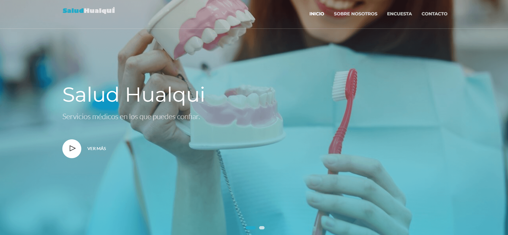
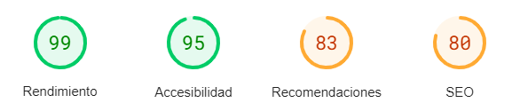

# SaludHualqui

## Description

This project centers around creating a new website for a healthcare center, building upon a pre-existing HTML template. The goal was to develop a modern, user-friendly website that effectively conveys information for a local Hualqui health center. Throughout this mini-project, I undertook the responsibility of enhancing the website's design and content, also optimizing its performance to ensure quicker loading speeds and an enhanced user experience.

*The language of the website is Spanish.

## PageSpeed Insights

## License
The image contents of the repository are covered under the [freepik](https://profile.freepik.com/license/free) license.
The website template was made by [Keenthemes](https://keenthemes.com/).
